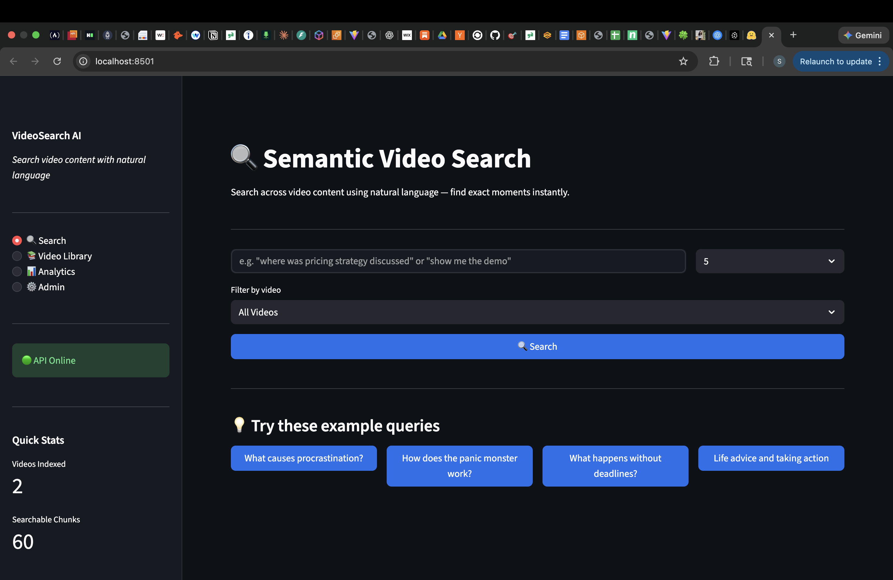
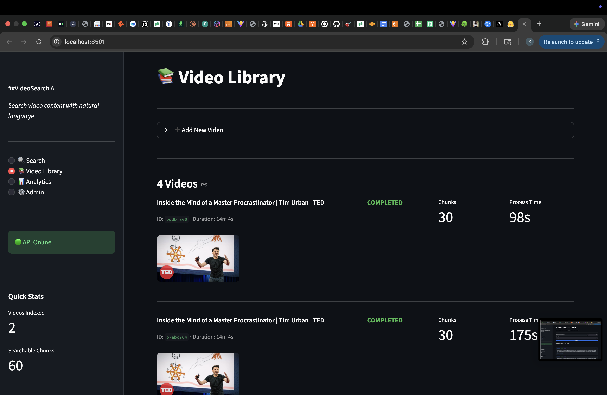
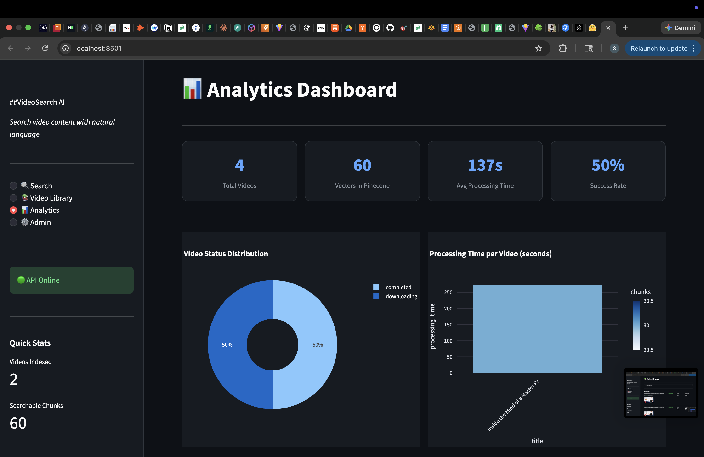
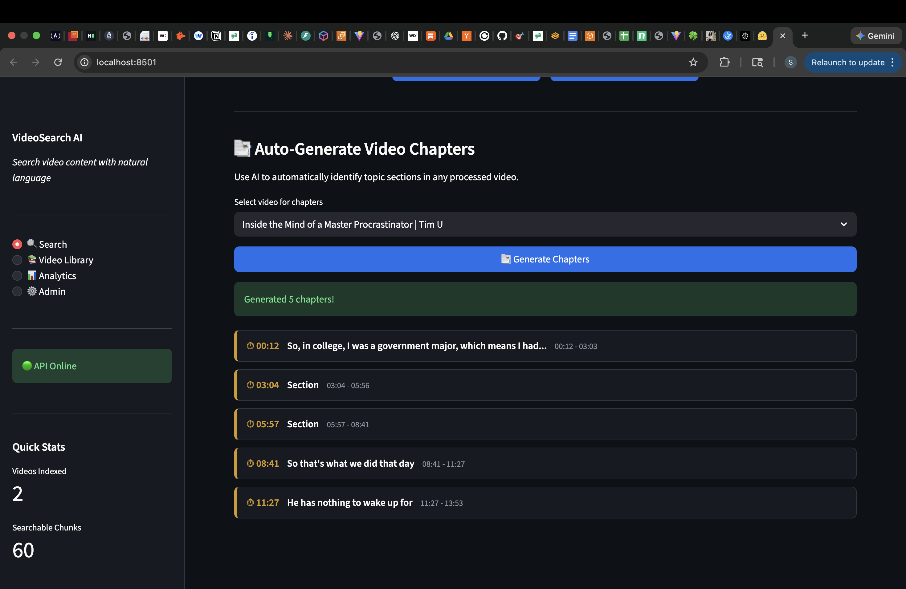
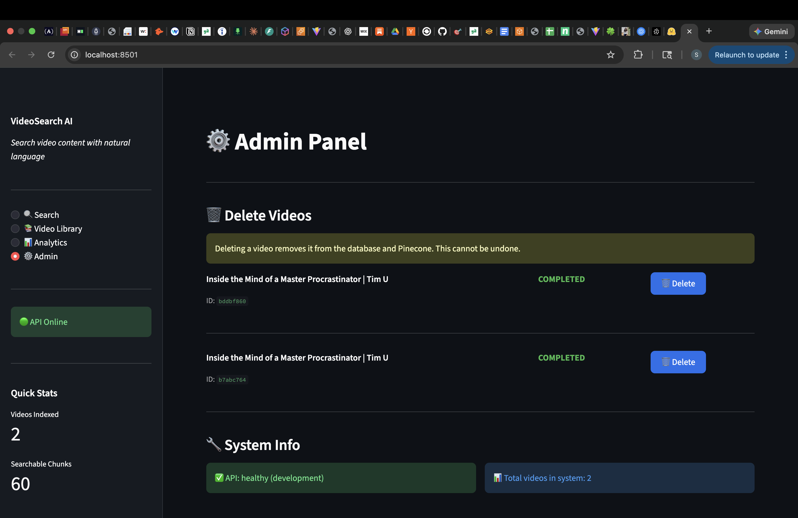

# Semantic Video Search Engine

> Search across video content using natural language — find exact moments instantly.


## What It Does

Upload any YouTube video and search through its content using natural language.
Ask *"where did they discuss pricing strategy?"* and instantly jump to that exact
moment with a YouTube timestamp link.

## Screenshots

### Semantic Search


### Video Library


### Analytics Dashboard


### Auto-Generated Chapters


### Admin Panel


## Features

- **Natural Language Search** — semantic search using sentence embeddings
- **Smart Search** — AI query expansion + cross-encoder re-ranking
- **Auto-Chapter Generation** — automatically splits videos into topic sections
- **Async Processing** — Celery job queue handles long videos in background
- **Multi-Video Search** — search across entire video library at once
- **YouTube Deep Links** — results link directly to the exact timestamp
- **Production Dashboard** — Streamlit UI with search, library, analytics, admin

## Architecture
```
YouTube URL
    │
    ▼
yt-dlp (download)
    │
    ├──▶ faster-whisper (transcribe) ──▶ text chunks with timestamps
    │
    └──▶ OpenCV (extract frames)
              │
              ▼
    sentence-transformers (embed)
              │
              ▼
         Pinecone (store vectors)
              │
              ▼
    Natural Language Query
              │
              ▼
    Query Expansion + Vector Search + Cross-Encoder Re-ranking
              │
              ▼
    Timestamped Results + YouTube Deep Links
```

## Tech Stack

| Layer | Technology |
|-------|-----------|
| Transcription | faster-whisper (Whisper base) |
| Embeddings | sentence-transformers (all-MiniLM-L6-v2) |
| Vector DB | Pinecone (serverless) |
| Re-ranking | cross-encoder/ms-marco-MiniLM-L-6-v2 |
| Backend API | FastAPI + SQLAlchemy |
| Job Queue | Celery + Redis |
| Database | PostgreSQL |
| Frontend | Streamlit |
| Video Processing | yt-dlp + OpenCV + ffmpeg |
| Containerization | Docker + Docker Compose |

## Quick Start

### Prerequisites
- Docker + Docker Compose
- Pinecone account (free tier)
- OpenAI API key (optional, for GPT-4o vision)

### 1. Clone the repo
```bash
git clone https://github.com/Sakshi3027/semantic-video-search.git
cd semantic-video-search
```

### 2. Set up environment
```bash
cp .env.example .env
# Edit .env with your API keys
```

### 3. Start with Docker
```bash
docker-compose up -d
```

### 4. Open the dashboard
```
http://localhost:8501
```

### Local Development (without Docker)
```bash
# Create virtual environment
python -m venv venv
source venv/bin/activate

# Install dependencies
pip install -r requirements.txt

# Start services
docker-compose up -d postgres redis

# Terminal 1 — API
uvicorn backend.main:app --reload --port 8000

# Terminal 2 — Worker
celery -A backend.workers.celery_app worker --loglevel=info --pool=solo

# Terminal 3 — Frontend
streamlit run frontend/app.py
```

## API Endpoints

| Method | Endpoint | Description |
|--------|----------|-------------|
| POST | `/api/v1/videos` | Submit video for processing |
| GET | `/api/v1/videos` | List all videos |
| GET | `/api/v1/videos/{id}` | Get video status |
| DELETE | `/api/v1/videos/{id}` | Delete video |
| POST | `/api/v1/search` | Semantic search |
| POST | `/api/v1/search/smart` | AI-enhanced search |
| GET | `/api/v1/videos/{id}/chapters` | Auto-generate chapters |

API docs available at `http://localhost:8000/docs`

## Performance

| Metric | Value |
|--------|-------|
| Processing time (14min video) | ~95 seconds |
| Search latency (cold) | ~4 seconds |
| Search latency (warm) | ~500ms |
| Embedding dimensions | 384 |

## Project Structure
```
semantic-video-search/
├── backend/
│   ├── api/
│   │   ├── routes.py        # FastAPI endpoints
│   │   └── schemas.py       # Pydantic models
│   ├── core/
│   │   ├── config.py        # Settings management
│   │   └── database.py      # SQLAlchemy setup
│   ├── models/
│   │   └── video.py         # DB models
│   └── workers/
│       ├── celery_app.py    # Celery config
│       └── tasks.py         # Async tasks
├── ml/
│   ├── pipeline.py          # End-to-end orchestration
│   ├── video_processor.py   # Download + frame extraction
│   ├── transcriber.py       # Whisper transcription
│   ├── embedder.py          # Embeddings + Pinecone
│   └── intelligence.py      # Query expansion + re-ranking
├── frontend/
│   └── app.py               # Streamlit dashboard
├── docker-compose.yml
├── Dockerfile
└── Dockerfile.frontend
```

## Roadmap

- [ ] GPT-4o Vision for visual content search
- [ ] Speaker diarization (who said what)
- [ ] Multi-language support
- [ ] Next.js frontend upgrade
- [ ] Cloud deployment (AWS/GCP)
- [ ] Batch video processing


## Author
**Sakshi Chavan**
- GitHub: [@Sakshi3027](https://github.com/Sakshi3027)
